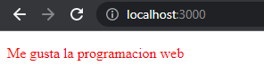
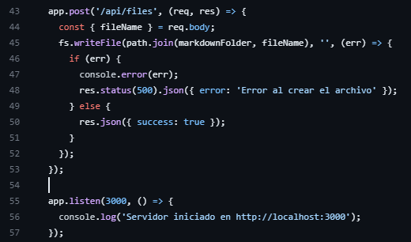
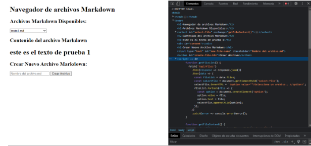

<table>
    <theader>
        <tr>
            <td></td>
            <th>
                UNIVERSIDAD NACIONAL DE SAN AGUSTIN 
                FACULTAD DE INGENIERÍA DE PRODUCCIÓN Y SERVICIOS 
                DEPARTAMENTO ACADÉMICO DE INGENIERÍA DE SISTEMAS E INFORMÁTICA 
                ESCUELA PROFESIONAL DE INGENIERÍA DE SISTEMAS
            </th>
            <td></td>
        </tr>
    </theader>
    <tbody>
        <tr><td colspan="3">Formato: Informe de Práctica de Laboratorio</td></tr>
        <tr><td>Aprobación:  2022/03/01</td><td>Código: GUIA-PRLD-001</td><td>Página: 1</td></tr>
    </tbody>
</table>

INFORME DE LABORATORIO 

<table>
<theader>
<tr><th colspan="6">INFORMACIÓN BÁSICA</th></tr>
</theader>
<tbody>
<tr><td>ASIGNATURA:</td><td colspan="5">Programación Web 2</td></tr>
<tr><td>TÍTULO DE LA PRÁCTICA:</td><td colspan="5">Ajax y NodeJS</td></tr>
<tr>
<td>NÚMERO DE PRÁCTICA:</td><td>03</td><td>AÑO LECTIVO:</td><td>2023 A</td><td>NRO. SEMESTRE:</td><td>III</td>
</tr>
<tr>
<td>FECHA INICIO::</td><td>29-may-2022</td><td>FECHA FIN:</td><td>29-Abr-2022</td><td>DURACIÓN:</td><td>04 horas</td>
</tr>
<tr><td colspan="6">RECURSOS:
    <ul>
        <li><a href="https://git-scm.com/book/es/v2">https://git-scm.com/book/es/v2</a></li>
        <li><a href="https://guides.github.com/">https://guides.github.com/</a></li>        
        <li><a href="https://www.w3schools.com/java/default.asp">https://www.w3schools.com/java/default.asp</a></li>
    </ul>
</td>
</<tr>
<tr><td colspan="6">DOCENTE:
<ul>
<li>Anibal Sardon </li>
</ul>
</td>
</<tr>
<tr><td colspan="6">INTEGRANTES:
<ul>
<li>Daniel Wilston Chura Monroy </li>
</ul>
<ul>
<li>Pedro Luis Christian Zapana Romero - pzapanar@unsa.edu.pe </li>
</ul>
</td>
</<tr>
</tdbody>
</table>

# Vim - Git - GitHub

[![License][license]][license-file]
[![Downloads][downloads]][releases]
[![Last Commit][last-commit]][releases]

[![Debian][Debian]][debian-site]
[![Git][Git]][git-site]
[![GitHub][GitHub]][github-site]
[![Vim][Vim]][vim-site]
[![Java][Java]][java-site]

#

## OBJETIVOS TEMAS Y COMPETENCIAS

### OBJETIVOS

- Conocer el editor de texto Vim.
- Aprender a manejar el sistema de control de versiones Git y utilizar GitHub para trabajar de manera colaborativa.

### TEMAS
- Aprender peticiones asíncronas en JavaScript usando JSON para la comunicación.
-	Programar en BackEnd usando JavaScript.
-	Entender el concepto de promises y los objetos no bloqueantes

COMPETENCIAS

- C.c Diseña responsablemente sistemas, componentes o procesos para satisfacer necesidades dentro de restricciones realistas: económicas, medio ambientales, sociales, políticas, éticas, de salud, de seguridad, manufacturación y sostenibilidad.
- C.m Construye responsablemente soluciones siguiendo un proceso adecuado llevando a cabo las pruebas ajustada a los recursos disponibles del cliente.
-	C.p Aplica de forma flexible técnicas, métodos, principios, normas, estándares y herramientas de ingeniería necesarias para la construcción de software e implementación de sistemas de información.

## CONTENIDO DE LA GUÍA

### MARCO CONCEPTUAL

- https://www.w3schools.com/nodejs/nodejs_intro.asp
-	https://nodejs.org/en/docs/guides/getting-started-guide/
-	https://nodejs.dev/learn
-	https://www.w3schools.com/js/js_api_fetch.asp
-	https://expressjs.com/es/
-	https://developer.mozilla.org/es/docs/Web/API/Fetch_API/Using_Fetch
-	https://developer.mozilla.org/es/docs/Learn/Server-side/Express_Nodejs/Introduction
-	Instale NodeJS
-	Cree un nuevo proyecto NodeJS.
-	Cree un archivo index.js

   

#

-	Luego lance el servidor con:  

    node index.js
-	Note que console imprime en la salida estándar y el cliente sólo recibe el texto “Hola Mundo”. http://127.0.0.1:3000/
-	El siguiente código modifica algunas líneas para usar un framework llamado express y devolver un archivo index.html
-	Para usar este código debe instalar express con npm:  

    $ npm install express 
-	Deberá crear un archivo index.html en el directorio de su proyecto.
-	Note que el servidor espera recibir una petición de tipo GET y el URL no contiene el nombre del archivo.  

    Index.js:
    
    
    
    Index.html:
    
    
    
    Ejecucion:
    
     
    
## EJERCICIO RESUELTO POR EL DOCENTE
-	Cree una aplicación web que ejecute javascript en el cliente (dentro de la carpeta pub) y nodejs en el servidor.

Index.js:

   

Index.html:

   
   
Ejecución:

   

-	Cree una aplicación web que realice una petición ajax en el lado del cliente y responda usando nodejs en el lado del servidor.
-	Si tiene errores lea: https://medium.com/zero-equals-false/using-cors-in-express-cac7e29b005b

Index.js:

   

Index.html:

   

Ejecución:

   

## EJERCICIOS PROPUESTOS
-	En grupos de 3 a 5 personas implemente una aplicación web que navegue sobre archivos Markdown y permita:
  1.	Listas los archivos Markdown disponibles

  
  
      Se utiliza el método readdir() para poder leer el directorio que se desea utilizar para guardar los archivos Markdown.
      
  

      La función getFileList() se encarga de recibir la información y crea una caja de selección con los archivos Markdown disponibles en el directorio.
      
  2.	Ver el contenido de un archivo Markdown traducido a HTML
  
  
      
      Se utiliza el método readFile() para poder leer el archivo que es requerido y se quiere mostrar.
      
  
  
      La función getFileContent() se encarga de recuperar la información del archivo que se quiere motrar.
  3.	Crear nuevos archivos MarkDown y almacenarlos en el servidor
  
  

      Utilizando el método writeFile() para poder crear un archivo del formato Markdown
      Ejecución:
      
  
       
  
       
  
      
- La comunicación entre el cliente y el servidor tiene que ser usando JSON sólamente. El cliente debe usar AJAX para sus peticiones El servidor debe usar NodeJS Su aplicación debe ser de página única, es decir que sólo habrá un archivo index.html y nada más.

  Server.js:
  
    
    
    
    
    
- Si los enlaces proporcionados en esta guía no le son suficientes, puede revisar códigos en Internet que le ayuden con cosas como ejemplos: listar un directorio en NodeJS; pero deberá incluir los enlaces correspondientes en sus archivos como comentarios y sólo podrá usar código de stackoverflow, incluir código de cualquier otra fuente está prohibido y se considerará actitud deshonesta.

## CUESTIONARIO
- En el Ejemplo "Hola Mundo" con NodeJS. ¿Qué pasó con la línea: "Content type ….."?
  Content type es un encabezado que indica el tipo de contenido que se envía al cliente. El cliente deberá recibir e interpretar el contenido. Por ejemplo si se establece content type  cómo text/html el cliente interpretará el código HTML y lo renderizara como una página web.
-	En los ejercicios. ¿En qué lugar debería estar el archivo poema.txt?
  El archivo poema.txt debe estar ubicado en la carpeta priv para poder ser ubicado por la dirección del archivo que se envía como parámetro en la siguiente línea de código:
fs.readFile(path.resolve(__dirname, 'priv/poema.txt'), 'utf8',
-	¿Entiende la expresión regular en el código y se da cuenta de para qué es útil?
  Si en este laboratorio se planteó el aprendizaje de métodos para obtención y transformación de archivos a html en formato JSON para así poder ser mostrados en una página web 
-	Note que la respuesta del servidor está en formato JSON, ¿Habrá alguna forma de verla directamente?
  Se puede visualizar el archivo JSON por medio de la url introduciondo la app que se encarga de devolver el archivo en formato JSON. Eje: http://localhost:3000/recitar

#

## REFERENCIAS
- JavaScript code using the latest ECMAScript. Packt Publishing Ltd, 2018.
-	Greg Lim. Beginning Node.js, Express & MongoDB Development. Amazon, 2019.
-	https://www.w3schools.com/nodejs/nodejs_intro.asp
-	https://nodejs.org/en/docs/guides/getting-started-guide/
-	https://nodejs.dev/learn
-	https://www.w3schools.com/js/js_api_fetch.asp
-	https://expressjs.com/es/
-	https://developer.mozilla.org/es/docs/Web/API/Fetch_API/Using_Fetch
-	https://developer.mozilla.org/es/docs/Learn/Server-side/Express_Nodejs/Introduction
-	Link repositorio: https://github.com/christian460/lab3-grupal.git
-	Link repositorio-Pedro: https://github.com/christian460/lab3.git
-	Link repositorio-Daniel: https://github.com/Dan1elMon/pw2-lab3.git

#

[license]: https://img.shields.io/github/license/rescobedoq/pw2?label=rescobedoq
[license-file]: https://github.com/rescobedoq/pw2/blob/main/LICENSE

[downloads]: https://img.shields.io/github/downloads/rescobedoq/pw2/total?label=Downloads
[releases]: https://github.com/rescobedoq/pw2/releases/

[last-commit]: https://img.shields.io/github/last-commit/rescobedoq/pw2?label=Last%20Commit

[Debian]: https://img.shields.io/badge/Debian-D70A53?style=for-the-badge&logo=debian&logoColor=white
[debian-site]: https://www.debian.org/index.es.html

[Git]: https://img.shields.io/badge/git-%23F05033.svg?style=for-the-badge&logo=git&logoColor=white
[git-site]: https://git-scm.com/

[GitHub]: https://img.shields.io/badge/github-%23121011.svg?style=for-the-badge&logo=github&logoColor=white
[github-site]: https://github.com/

[Vim]: https://img.shields.io/badge/VIM-%2311AB00.svg?style=for-the-badge&logo=vim&logoColor=white
[vim-site]: https://www.vim.org/

[Java]: https://img.shields.io/badge/java-%23ED8B00.svg?style=for-the-badge&logo=java&logoColor=white
[java-site]: https://docs.oracle.com/javase/tutorial/

[![Debian][Debian]][debian-site]
[![Git][Git]][git-site]
[![GitHub][GitHub]][github-site]
[![Vim][Vim]][vim-site]
[![Java][Java]][java-site]

[![License][license]][license-file]
[![Downloads][downloads]][releases]
[![Last Commit][last-commit]][releases]
